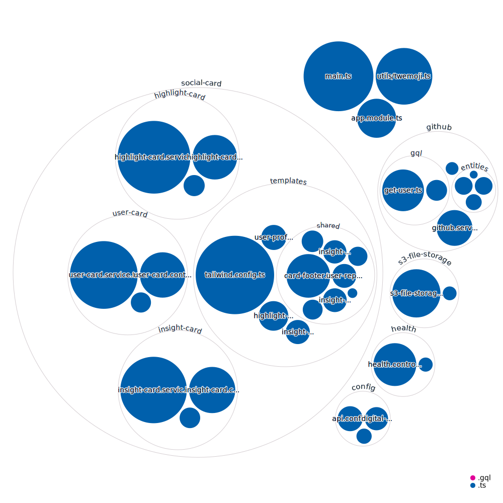

# 🍕 KhulnaSoft OpenSource OpenGraph Generator 🍕

> The path to your next Open Source contribution

[](https://github.com/khulnasoft-opensource/opengraph.khulnasoft.com/pulse)
[](https://github.com/khulnasoft-opensource/opengraph.khulnasoft.com/pulse)
[](https://github.com/khulnasoft-opensource/opengraph.khulnasoft.com/issues)
[]labelColor=6A7EC2)](https://discord.gg/U2peSNf23P)
[](https://twitter.com/saucedopen)

</div>

## 🚀 Live release environments

### Production ([main](https://github.com/khulnasoft-opensource/opengraph.khulnasoft.com/tree/main))

- [opengraph@digital-ocean.app](https://cloud.digitalocean.com/apps/41eb42f8-3ca9-4598-b9c7-4378868a5702)
- [opengraph.opensauced](https://opengraph.khulnasoft.com)

### Beta ([beta](https://github.com/khulnasoft-opensource/opengraph.khulnasoft.com/tree/beta))

- [opengraph-beta@digital-ocean.app](https://cloud.digitalocean.com/apps/7fd2cd42-4df7-4204-af8b-0e7ec252c324/overview)
- [beta.opengraph.opensauced](https://beta.opengraph.khulnasoft.com)

## 📖 Prerequisites

In order to run the project we need the following software binaries installed on our development machines:

- [x] `node>=18.15.0`
- [x] `npm>=9.6.3`
- [ ] `docker>=20.10.23`

## 🖥️ Local development

To install the application:

```shell
npm ci
```

To start a local copy of the app on port `3001`:

```shell
npm run start:dev
```

### Local dev scripts

There are a few scripts that can be used to generate and test the social cards locally without having to deploy to the CDN. This is the way to go when developing & testing the interface for the social cards.

#### Generating user profile cards

```shell
npm run test:local:user
```

> Generates user cards for all users in the test array inside `test/local-dev/UserCards.ts` and outputs them in `dist/local-dev/` for testing.

The same goes for the other card types:

- `npm run test:local:insight` is for generating insight cards.
- `npm run test:local:highlight` is for generating highlight cards.

The output of these scripts can be found in the `dist/local-dev/` folder as well.

### 📝 Environment variables

Some environment variables are required to run the application. You can find them in the `.env.example` file. While most of them are optional, some are required to run the application.

One can reverse engineer the [named configs](./src/config) but some need a little explanation.

Boilerplate, changed mostly locally:

```dotenv
# GitHub private access tokens
GITHUB_PAT_USER=ghp_************************************

# DigitalOcean Spaces through aws-sdk configuration
DO_SPACES_ACCESS_KEY_ID=********************
DO_SPACES_SECRET_ACCESS_KEY=*******************************************
```

Ping @khulnasoft-opensource/maintainers to get the dev CDN keys for the `DO_SPACES_*` variables.

Other Digital Ocean S3 variables are sensibly set to default for local development, here are the defauls:

```dotenv
DO_SPACES_ENDPOINT=digitaloceanspaces.com
DO_SPACES_REGION=sfo3
DO_SPACES_BUCKET_NAME=opengraph-dev
```

It is also advised to set the following variables to `true` to avoid using the cached CDN during development:

```dotenv
DO_SPACES_CDN_DISABLED=true
```

If using a custom domain, you can set the following variable to the domain name:

```dotenv
DO_SPACES_SUBDOMAIN=beta.opengraph-cdn.khulnasoft.com
```

Other API defaults you can change are not required in local development, but can sometimes appear configured differently for production:

```dotenv
API_HOST=0.0.0.0
API_PORT=3005
API_DOMAIN=opengraph.khulnasoft.com
MEMORY_HEAP=200
MEMORY_RSS=3000
DISK_PERCENTAGE=0.7
DISK_SIZE=100
```

### 🎨 Code linting

To check the code and styles quality, use the following command:

```shell
npm run lint
```

This will also display during development, but not break on errors.

To fix the linting errors, use the following command:

```shell
npm run format
```

It is advised to run this command before committing or opening a pull request.

### 📕 Types

We have a couple of scripts to check and adjust missing types.

In order to dry run what types would be added to `package.json`:

```shell
npm run types:auto-check
```

In order to add any missing types to `package.json`:

```shell
npm run types:auto-add
```

### 🚀 Production deployment

A production deployment is a complete build of the project, including the build of the static assets.

```shell
npm run build
```

## 🤝 Contributing

We encourage you to contribute to KhulnaSoft OpenSource! Please check out the [Contributing guide](https://opengraph.khulnasoft.com/contributing/introduction-to-contributing/) for guidelines about how to proceed.


## 🍕 Community

Got Questions? Join the conversation in our [Discord](https://discord.gg/U2peSNf23P).  
Find KhulnaSoft OpenSource videos and release overviews on our [YouTube Channel](https://www.youtube.com/channel/UCklWxKrTti61ZCROE1e5-MQ).

## 🎦 Repository Visualization

Below is visual representation of our code repository. It is generated by [Octo Repo Visualizer](https://github.com/githubocto/repo-visualizer).

This visualization is being updated on release to our default branch by our [release workflow](./.github/workflows/release.yml).

[
](./src)

## ⚖️ LICENSE

MIT © [KhulnaSoft OpenSource](LICENSE)
